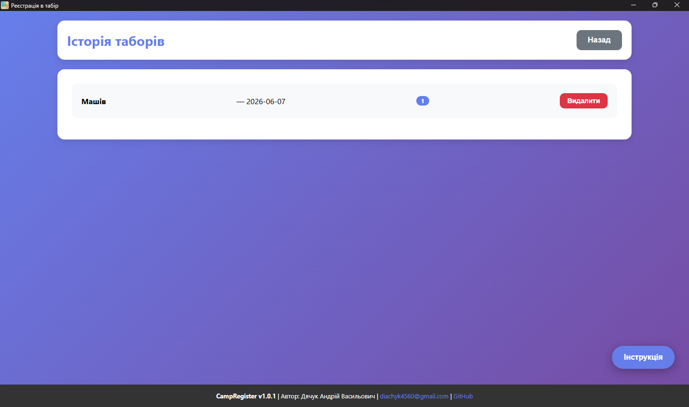

<div align="center">

# 🏕️ CampRegister

### Система реєстрації дітей у літній табір з автоматичним друком бейджів

[](LICENSE)
[](https://www.microsoft.com/windows)
[](CHANGELOG.md)
[](https://tauri.app/)

---

<p align="center">
  
  
  
</p>

</div>

---

## 📥 Завантаження

<table>
<tr>
<td width="50%" align="center">

### 💿 Інсталятор

**[CampRegister_Setup.exe](releases/CampRegister_Setup.exe)**

✅ Встановлення в систему  
✅ Іконка в меню Пуск  
✅ Автооновлення  
✅ Рекомендовано для постійного використання

📦 Розмір: 2.2 MB

</td>
<td width="50%" align="center">

### 📦 Portable версія

**[CampRegister_Portable.exe](releases/CampRegister_Portable.exe)**

✅ Не потребує встановлення  
✅ Запуск з USB флешки  
✅ Повністю автономна  
✅ Рекомендовано для тимчасового використання

📦 Розмір: 11 MB

</td>
</tr>
</table>

---

## ✨ Основні можливості

<table>
<tr>
<td width="33%" align="center">

### 📝 Швидка реєстрація
Прізвище, ім'я, вік — і готово!  
Автоматичний розподіл по групах

</td>
<td width="33%" align="center">

### 🖨️ Друк бейджів
Формат 70×30 мм  
Попередній перегляд перед друком

</td>
<td width="33%" align="center">

### 📊 Excel експорт
Автоматичне збереження у .xlsx  
Зручний формат для звітності

</td>
</tr>
<tr>
<td width="33%" align="center">

### 🌐 Мережева синхронізація
Робота з кількох комп'ютерів  
Автоматична синхронізація даних

</td>
<td width="33%" align="center">

### 💾 Backup/Restore
Захист даних  
Швидке відновлення

</td>
<td width="33%" align="center">

### ⚡ Повністю офлайн
Не потрібен інтернет  
Працює скрізь

</td>
</tr>
</table>

---

## 🚀 Швидкий старт

```
1️⃣ Завантажте програму
2️⃣ Запустіть (інсталюйте або відкрийте portable)
3️⃣ Введіть місце та дату табору
4️⃣ Реєструйте дітей та друкуйте бейджики
```

**Готово!** 🎉

---

## 📖 Документація

| Документ | Опис |
|----------|------|
| 📘 [Швидкий старт](QUICKSTART.md) | Початок роботи за 3 хвилини |
| 📗 [Повна інструкція](docs/USER_GUIDE.md) | Детальний посібник користувача |
| 📕 [FAQ](docs/FAQ.md) | Відповіді на часті питання |
| 📙 [Для розробників](docs/DEVELOPMENT.md) | Збірка проекту з коду |
| 📔 [Історія змін](CHANGELOG.md) | Список оновлень |

---

## 🎨 Скріншоти

### Головна сторінка


### Сторінка реєстрації


### Історія таборів


### Налаштування груп


### Налаштування друку бейджиків


### Налаштування мережі


### Підтвердження видалення


---

## 🔧 Системні вимоги

| Компонент | Мінімальні вимоги |
|-----------|-------------------|
| **ОС** | Windows 10 / 11 (64-bit) |
| **RAM** | 4 GB |
| **Диск** | 50 MB вільного місця |
| **Принтер** | Будь-який сумісний з Windows (опціонально) |

---

## 🎯 Особливості

- **🎨 Кольорові групи** — автоматичний розподіл за віком з кольоровим кодуванням
- **👥 Мультиюзер** — одночасна робота з кількох комп'ютерів
- **📱 Адаптивний інтерфейс** — зручно на будь-якому екрані
- **🔒 Безпека даних** — локальне зберігання, без відправки в інтернет
- **⚙️ Гнучкі налаштування** — повна настройка груп і параметрів друку
- **📈 Статистика** — миттєвий перегляд кількості дітей по групах

---

## 🛠️ Технології

<p align="center">
  
  
  
  
  
</p>

---

## 📝 Ліцензія

```
MIT License

Copyright (c) 2026 Дячук Андрій Васильович

Дозволяється безкоштовне використання, копіювання, модифікація
та розповсюдження цього програмного забезпечення.
```

Повний текст: [LICENSE](LICENSE)

---

## 👨‍💻 Автор

<div align="center">

**Дячук Андрій Васильович**

[](mailto:diachyk4560@gmail.com)

</div>

---

## 🌟 Підтримка проекту

Якщо проект виявився корисним — поставте ⭐ на GitHub!

<div align="center">

### 🐛 Знайшли баг?

[Створіть Issue](https://github.com/zeroprotocolx86/camp-register-software/issues) → Я швидко виправлю!

### 💡 Є ідея?

[Напишіть мені](mailto:diachyk4560@gmail.com) → Я обов'язково розгляну!

</div>

---

